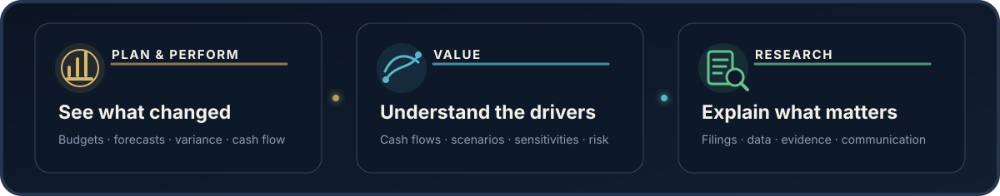

  

  <h1>Faiz Chhapra</h1>

  
<strong>Financial Analysis · Valuation · Forecasting · Investment Research</strong>

  
I use data and automation to sharpen financial judgment and make decisions clearer.

  

    <a href="https://www.faizchhapra.com">Website</a>
    &nbsp;·&nbsp;
    <a href="https://www.linkedin.com/in/faiz-chhapra/">LinkedIn</a>
  

## I like finance when it leads somewhere.

I work across planning, performance analysis, valuation, and investment research. My background includes pharmaceutical finance, financial reporting, economic research, and finance education.

For me, the interesting part is not building another spreadsheet, model, or dashboard. It is figuring out what changed, why it changed, what it means for the forecast or valuation, and what decision should follow.

> Good analysis makes assumptions visible, calculations defensible, and conclusions clear.

## How I think

| **01 · Frame** | **02 · Analyze** | **03 · Communicate** |
|:---|:---|:---|
| Start with the financial question and the decision it needs to support. | Organize the data, understand the drivers, test assumptions, and investigate what does not make sense. | Explain the result, the tradeoffs, and where judgment is still required. |

 

  

## My toolkit in practice

**Planning and performance**  
Budgeting, forecasting, budget versus actual analysis, working capital, reconciliations, and management reporting.

**Valuation and investment analysis**  
DCF, scenario and sensitivity analysis, fundamental research, portfolio context, and credit risk.

**Data and technology in finance**  
Excel, SAP S/4HANA, Power BI, Python, SQL, and R used to make analysis more repeatable and useful.

## A living portfolio

This GitHub is a living record of the financial models, research, dashboards, and tools I build over time. Some ideas will begin as experiments. Others will become detailed case studies. I will keep improving the work as my thinking, experience, and toolkit grow.

What matters to me is that the financial logic is understandable, the assumptions are visible, and the result is genuinely useful.

## Current perspective

I currently work as a Financial Coordinator at **Zydus Pharmaceuticals (USA)** and hold an M.S. in Finance from **Gies College of Business, University of Illinois Urbana Champaign**. I am especially interested in problems across corporate finance, valuation, investment research, and decision support.

 

  <strong>Finance is the core. Technology is the tool. GitHub is the evidence.</strong>
    
  <a href="https://www.faizchhapra.com">Explore my work</a>
  &nbsp;·&nbsp;
  <a href="https://www.linkedin.com/in/faiz-chhapra/">Connect on LinkedIn</a>

